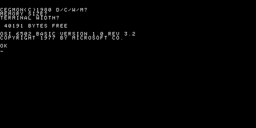
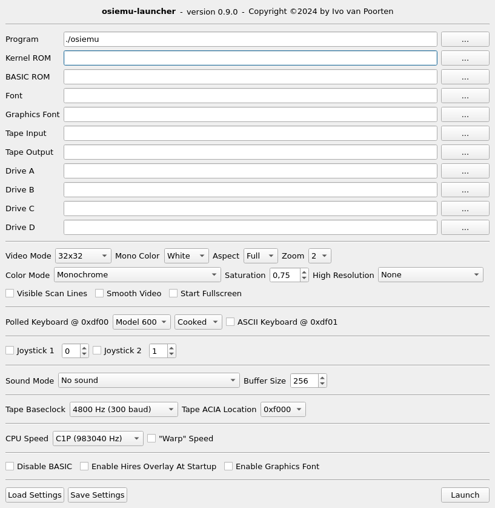

# osiemu
Ohio Scientific Instruments, Inc. Emulator for Linux and Windows

Binary releases for Linux and Windows are [here](https://github.com/ivop/osiemu/releases).

  

1. [Features](#features)
2. [Keybindings](#keybindings)
3. [Monitor](#monitor)
4. [Command line options](#command-line-options)
5. [Configuration files](#configuration-files)
6. [Build instructions](#build-instructions)
7. [Disk images](#disk-images)
8. [GUI launcher](#gui-launcher)
9. [CP/M-65](#cpm-65)
10. [Notes](#notes)

## Features

* NMOS 6502 CPU
* Selectable CPU speed, including "warp speed"
* 40kB RAM, or 48kB RAM without BASIC (Model 522)
* 8kB BASIC ROM
* Up to 4kB OS/Monitor ROM
* Polled keyboard, Model 542 or Model 600 mode, raw or cooked
* ASCII keyboard, Model 440B
* Two joysticks (d-pad or analog)
* 64x32, 64x16, and 32x32 character based display
* Switchable ASCII font and graphics font
* Color modes:
  * Monochrome white, green, amber, or bluish
  * Model 440B, 6-bit ASCII, 4 colors
  * Model 540B, 8 colors, inverse video
  * Model 630 Color Video Expander, 16 colors RGB, 8 dimmed, 8 bright
* High resolution overlays:
  * Model 440B, 128x128
  * Model 541, 256x256, High Resolution Graphics Expander
* Serial tape ACIA with selectable baudrate and memory location
* Bit-level floppy emulation, Model 470/505, up to four single sided 5¼" or 8" drives
* Hardware accelerated display
  * full resolution 512x256
  * configurable frame rate
  * optional 2x, 3x, or 4x zoom
  * optional TV aspect ratio 16:9 or 4:3
  * optional anti-aliasing
  * optional scan lines or dots
* Sound modes:
  * Model 542B/C keyboard tone generator and 8-bit DAC
  * Superboard II/Model 600/C1P keyboard 8-bit DAC
* On-Screen Display during peripheral access
* Built-in monitor, dump/change memory contents, registers, set breakpoints, disassembler

## Keybindings

| Key | Function |
| --- | --- |
| F3 | Hardware switch, hi-res overlay |
| F4 | Hardware switch, normal font / graphics font |
| F5 | Hardware reset |
| F8 | Enter monitor |
| F9 | Exit emulator |
| F11 | Toggle fullscreen |

## Monitor

| Command | Arguments | Function |
| --- | --- | --- |
| q,quit |              | exit emulator |
| cont |                | continue emulation |
| help |                | print this help |
| show |                | show emulation window |
| hide |                | hide emulation window |
| d | [mem]             | dump memory contents |
| c | mem val ...       | change memory to value(s) |
| f | beg end val       | fill memory with value |
| regs |                | display CPU registers |
| setcpu | type         | set CPU type to nmos\|undef\|cmos |
| u | [mem]             | unassemble memory |
| setbp | mem           | set breakpoint |
| clrbp |               | clear breakpoint |
| l | mem file          | load raw data from file to mem |
| s | beg end file      | save raw data to file |
| setpc | val           | set PC to value |
| seta | val            | set A to value |
| setx | val            | set X to value |
| sety | val            | set Y to value |
| setsp | val           | set SP to value |
| setp | val            | set P to value |
| tapes |               | list current tape files |
| eject | input \| output | eject input or output tape |
| insert | input \| output file | insert input or output tape |
| rewind | input \| output | rewind input or output tape |
| drives |              | list mounted floppies |
| swap | numx numy      | swap drives numx and numy |
| unmount | num         | unmount drive |
| mount | num file      | mount file to drive num |
| trace | on \| off \| clear \| save [file] | CPU tracing |
| hm | on \| off \| clr \| save [file] \| img [file] | memory heatmap (r/w) |


## Command line options

```
usage: osiemu <config-file>
       osiemu [options]

options:

    -b/--basic filename.rom    specify BASIC ROM
    -k/--kernel filename.rom   specify kernel ROM

    -c/--font filename         specify character set font (8x2048 image)
    -q/--graph-font filename   specify graphics font (8x2048 image)

    -K/--cpu-speed speed       select speed: quarter    0.983040 MHz (default)
                                             half       1.966080 MHz
                                             510c-slow  1.000000 MHz
                                             510c-fast  2.000000 MHz
                                             540bw      0.982500 MHz
                                             540col     1.006667 MHz

    -v/--disable-video         disable video RAM (default: enabled)
    -m/--video-mode mode       forced modes:   64x32 (default)
                                               64x16
                                               32x32
                                               32x32s64
                               variable modes: 540b (32x32s64 / 64x32)
                                               600 (32x32 / 64x16)
    -M/--mono-color color      monochrome color green, amber, bluish or white
    -a/--aspect mode           aspect mode: full (default), 16:9 or 4:3
    -z/--zoom factor           increase display size by factor (2, 3, or 4)
    -V/--smooth-video          enable anti-aliased scaling
    -C/--color-mode mode       mode: monochrome (default), 440b, 540b, 630
    -d/--frame-rate rate       display rate: 60     60.000000 Hz (default)
                                             540bw  59.967041 Hz
                                             540col 61.442057 Hz
    -s/--saturation            color saturation [0.0-1.0], default: 0.75
    -H/--hires-mode mode       mode: none, 440b (128x128), 541 (256x256)
    -S/--scanlines             emulate visual scanlines (zoom >= 2 only)
    -x/--pixels                emulate visual pixels (implies scanlines)

    -A/--ascii-keyboard        enable ASCII keyboard at 0xdf01
    -r/--raw-keyboard          enable raw keyboard mode
    -i/--invert-keyboard       invert keyboard matrix signals (model 542)

    -j/--joystick1 index       specify joystick 1
    -J/--joystick2 index       specify joystick 2

    -t/--tape-input file       specify tape input file (default: none)
    -T/--tape-output file      specify tape output file (default: none)
    -L/--tape-location         ACIA location: f000 (default), fc00
    -B/--tape-baseclock        set baseclock (default: 4800)

    -f/--floppy0 file          specify floppy0 file (default: none)
    -F/--floppy1 file          specify floppy1 file (default: none)
    -g/--floppy2 file          specify floppy2 file (default: none)
    -G/--floppy3 file          specify floppy3 file (default: none)

    -R/--force-ramtop hex      force RAM top to location hex

    -y/--sound-mode mode       mode: none, 542b (DAC+tone), 600 (DAC)
    -Y/--sound-bufsize size    set sound buffer size (32-2048, default: 256)

    -w/--warp-speed            run emulator as fast as possible

    -Z/--switches switches     comma separated list of hardware switches
                               "flipped" before startup
                                 hires       enable high resolution overlay
                                 graph       enable graphics font
                                 nobasic     disable BASIC ROM (8kB extra RAM)
                                 fullscreen  start fullscreen

    -D/--debug flag,...        enable debug messages: floppy

    -h/--help                  show usage information
```

## Configuration files

Configuration files contain command line options, one per line.
The leading -- is optional.
If an option requires an argument, the option and the argument can be
separated by either a space or a '='.
Everything after the first space or '=' until the end of the line is
considered the argument. There's no need (and it's not supported) to put
arguments between single or double quotes. Escaping of characters isn't
needed either.

Example:

```
zoom 2
scanlines
video-mode=32x32
--cpu-speed half
kernel=long path with spaces/synmon.rom
```

More examples are in the _config_ directory.  

## Build instructions

### Linux

```
git clone --recurse-submodules https://github.com/ivop/osiemu
cd osiemu
make release
```

```make``` without any arguments will build a debug version (no optimizations, and level 3 debug info).  
You can override the sdl2-config utility used by setting the SDL2CONFIG variable on the command line, i.e.  
```
make -j8 release SDL2CONFIG=/path/to/sdl2-config CC=/path/to/my/compiler
```  

### Windows

Use Cygwin64. MinGW64 doesn't work because it is missing mmap, O_NONBLOCK, and getline.

## Disk images

```osiemu``` uses its own disk image format.
For each track it contains the complete bitstream that enters the floppy ACIA,
including all the framing and prolonged stop bits for timing.
See [_doc/disk-format.txt_](doc/disk-format.txt) for details.
The _tools_ directory contains ```hfe2osi``` and ```osi2hfe``` to convert
from and to HFE flux dumps from/for real hardware.

## GUI launcher

  

If you are tired of fiddling with command line options, there's also a GUI launcher.
To build, use:

```
make osiemu-launcher
```

You'll need either Qt5 or Qt6 to build it.
If you want to override the default ```qmake``` that's used during the build process,
you can specify it on the command line.
For example:

```
make -j8 osiemu-launcher QMAKE=/path/to/Qt/6.7.2/gcc_64/bin/qmake6 CXX=/path/to/clang++
```

forces a build against Qt 6.7.2 and use the clang compiler.
It has been tested with Qt 5.15.x and Qt 6.5.x and up.
On Windows, contrary to the main ```osiemu``` binary that has to be built with Cygwin, the launcher binary has to be built with MinGW.
Preferably the version that is distributed with Qt itself.

## CP/M-65

The _cpm65_ directory contains several disk images of the Ohio Scientific port of CP/M-65.
Alongside you'll find .settings files for the GUI launcher, and .config files that can be used from the command line.
For more information on what CP/M65 exactly is, how to use it, and possibly newer disk images, see the [CP/M-65 website](https://github.com/davidgiven/cpm65).
If you want to try out the serial systems version, you'll need to make sure the serial tape input and output settings point to the right (virtual) device.
As an example, they now point to /dev/pts/3.

## Notes

* The polled keyboards were limitted and had only 45 keys. Not all ASCII characters can be typed.
  Especially in raw mode, it behaves kind of weird, like CAPS affecting the number keys.
  This was by design and is normal. Cooked keyboard mode (the default) overcomes some of these quirks in emulation.
  For games you might need to switch to raw mode though, as they might do their own keyboard scan for certain combinations.
* The original ROMs did not implement backspace, even though there was a RUB key on the keyboard.
  If you want backspace in BASIC, use one of the cegmon ROMs.
* Error messages in BASIC have all kind of strange characters in them. That's normal and not a bug.
* It's possible to create a configuration that did not exist, doesn't make sense, or would not even be possible with real hardware.
  Just don't do that ;) See the sample configurations for sensible setups.
* Floppy disk emulation is enabled by specifying at least one floppy drive. The type is determined by the first floppy.
  You cannot mix 5.25" and 8" disk images. It's either four times 5.25" or four times 8".
* To emulate a serial-only system like the C3, you can disable video completely (--disable-video) and use the tape I/O ACIA as serial input and output.
  You can specify a real serial port (e.g. /dev/ttyUSB0), a pair of named pipes (mkfifo), or one end of two connected pseudo-terminals.
  
  Example:
  ```
  $ socat -d -d pty,rawer,echo=0 pty,rawer,echo=0
  2024/09/06 01:02:38 socat[936204] N PTY is /dev/pts/9
  2024/09/06 01:02:38 socat[936204] N PTY is /dev/pts/10
  2024/09/06 01:02:38 socat[936204] N starting data transfer loop with FDs [5,5] and [7,7]
  ```
  In another window:
  ```
  $ minicom -D /dev/pts/9 -b 19200
  ```
  And in yet another window:
  ```
  $ ./osiemu --disable-video \
             --kernel kernel/syn-c3-serial-hdm.rom \
             --tape-location fc00 \
             --tape-baseclock 19200 \
             --tape-input /dev/pts/10 \
             --tape-output /dev/pts/10 \
             --floppy0 some-floppy.os8
  ```
  
## Future additions?

* Binary release
* CP/M-65 sample disk images
* Sound: 1-bit ACIA RTS DAC (which model? where is the software?)
* Sound: SN76489AN and/or AY-3-8910 daughterboard
* Harddisk: Model 590/592/594/596/598 Winchester, Shugart, and Okidata, CD-74 74MB, CD-36 36MB, CD-28 28MB, CD-23 23MB, or CD-7 7MB hard drives.
* Serial: Implement S1883 UART. Is it worth it? C3 serial ROM/BASIC uses it as the alternate tape interface.
