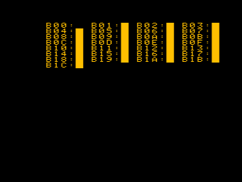

[tests/memtest.s](../../tests/memtest.s) implements a MARCH MSS memory tester.
Use ```make badram``` to build several osiemu binaries which simulate various bad RAM conditions.
Memory space for the tester is extremely tight (512 bytes), but after
droping the title header, and some further size vs speed optimizations,
it fits.
It still has a busy animation.

Block $00 is always skipped, as that's were ZP, the stack, and the tester reside, and it is assumed to be correctly working RAM.
It's advised that once one or more banks are tested OK, to physically swap that bank with bank $00 to have that chip tested, too.

Results, 100% coverage:

badram1  
  
badram2  
  
badram3  
  

This might not look interesting, but for example MATS++ didn't detect around
half of the simulated bad RAM blocks, and MARCH C- also failed to detect
some of the more intricate errors, like DRDF, and CFxd.

References:
* G. Harutunyan, V. A. Vardanian, and Y. Zorian, “Minimal march tests for unlinked static faults in random access memories,”
in 23rd IEEE VLSI Test Symposium (VTS’05), 2005, pp. 53–59, doi: 10.1109/VTS.2005.56.
[sci-hub link](https://sci-hub.se/10.1109/VTS.2005.56)
* [Understanding Memory Fault Models](https://www.embedded.com/understanding-memory-fault-models/)  


##### osiemu-badram1

| block | type |
| --- | --- |
| 01 | (R) IRF - Incorrect Read Fault, return flipped |
| 02 | (R) RDF - Read Destructive Fault, return flipped, flip in RAM |
| 03 | (R) DRDF - Deceptive Read Destructive Fault, ret correct, flip in RAM |
| 04 | (R) SOF - Stuck Open Fault, return prev. bus value |
| | |
| 05 | (W) SAF - Stuck At Fault, 1 |
| 06 | (W) SAF - Stuck At Fault, 0 |
| 07 | (W) TF - Transition Fault, 0->1 failure |
| 08 | (W) TF - Transition Fault, 1->1 failure |
| 09 | (W) WDF - Write Destructive Fault, 0w0->1 |
| 0a | (W) WDF - Write Destructive Fault, 1w1->0 |
| | |
| 0b | (R) ADF - Address Decoder Fault, Multiple Words, Single Address |
| 0c | (R/W) ADF - Address Decoder Fault, Single Word, Multiple Addresses |
| | |
| 0d | (W) CFin - Inversion Coupling Fault, v above a, 0->1 |
| 0e | (W) CFin - Inversion Coupling Fault, v above a, 1->0 |
| 0f | (W) CFin - Inversion Coupling Fault, v below a, 0->1 |
| 10 | (W) CFin - Inversion Coupling Fault, v below a, 1->0 |
| | |
| 11 | (W) CFid - Idempotent Coupling Fault, v above a, 0->1 clear v |
| 12 | (W) CFid - Idempotent Coupling Fault, v above a, 1->0 clear v |
| 13 | (W) CFid - Idempotent Coupling Fault, v below a, 0->1 clear v |
| 14 | (W) CFid - Idempotent Coupling Fault, v below a, 1->0 clear v |
| | |
| 15 | (W) CFid - Idempotent Coupling Fault, v above a, 0->1 set v |
| 16 | (W) CFid - Idempotent Coupling Fault, v above a, 1->0 set v |
| 17 | (W) CFid - Idempotent Coupling Fault, v below a, 0->1 set v |
| 18 | (W) CFid - Idempotent Coupling Fault, v below a, 1->0 set v |
|  |
| 19 | (W) CFst - Static Coupling Fault, v above a, a0, v0 |
| 1a | (W) CFst - Static Coupling Fault, v above a, a0, v1 |
| 1b | (W) CFst - Static Coupling Fault, v below a, a0, v0 |
| 1c | (W) CFst - Static Coupling Fault, v below a, a0, v1 |

(a=1 CFst missing)

##### osiemu-badram2

| block | type |
| --- | --- |
| 01 | (R) CFds - Disturb Cell Coupling Fault, V below A, A=0, set V |
| 02 | (R) CFds - Disturb Cell Coupling Fault, V above A, A=0, set V |
| 03 | (R) CFds - Disturb Cell Coupling Fault, V below A, A=0, clear V |
| 04 | (R) CFds - Disturb Cell Coupling Fault, V above A, A=0, clear V |
| 05 | (R) CFds - Disturb Cell Coupling Fault, V below A, A=1, set V |
| 06 | (R) CFds - Disturb Cell Coupling Fault, V above A, A=1, set V |
| 07 | (R) CFds - Disturb Cell Coupling Fault, V below A, A=1, clear V |
| 08 | (R) CFds - Disturb Cell Coupling Fault, V above A, A=1, clear V |
| | |
| 09 | (W) CFds - Disturb Cell Coupling Fault, V below A, A0->1, set V |
| 0a | (W) CFds - Disturb Cell Coupling Fault, V above A, A0->1, set V |
| 0b | (W) CFds - Disturb Cell Coupling Fault, V below A, A0->1, clear V |
| 0c | (W) CFds - Disturb Cell Coupling Fault, V above A, A0->1, clear V |
| | |
| 0d | (W) CFds - Disturb Cell Coupling Fault, V below A, A0->0, set V |
| 0e | (W) CFds - Disturb Cell Coupling Fault, V above A, A0->0, set V |
| 0f | (W) CFds - Disturb Cell Coupling Fault, V below A, A0->0, clear V |
| 10 | (W) CFds - Disturb Cell Coupling Fault, V above A, A0->0, clear V |
| | |
| 11 | (W) CFds - Disturb Cell Coupling Fault, V below A, A1->0, set V |
| 12 | (W) CFds - Disturb Cell Coupling Fault, V above A, A1->0, set V |
| 13 | (W) CFds - Disturb Cell Coupling Fault, V below A, A1->0, clear V |
| 14 | (W) CFds - Disturb Cell Coupling Fault, V above A, A1->0, clear V |
| | |
| 15 | (W) CFds - Disturb Cell Coupling Fault, V below A, A1->1, set V |
| 16 | (W) CFds - Disturb Cell Coupling Fault, V above A, A1->1, set V |
| 17 | (W) CFds - Disturb Cell Coupling Fault, V below A, A1->1, clear V |
| 18 | (W) CFds - Disturb Cell Coupling Fault, V above A, A1->1, clear V |
| | |
| 19 | (R) CFir - Incorrect Read Coupling Fault, a below v, flip if a=0, v=1 |
| 1a | (R) CFir - Incorrect Read Coupling Fault, a above v, flip if a=0, v=1 |
| 1b | (R) CFir - Incorrect Read Coupling Fault, a below v, flip if a=1, v=1 |
| 1c | (R) CFir - Incorrect Read Coupling Fault, a above v, flip if a=1, v=1 |

##### olsiemu-badram3

| block | type |
| --- | --- |
| 01 | (W) CFtr - Transition Coupling Fault, fail w0->1, a below v, a=0 |
| 02 | (W) CFtr - Transition Coupling Fault, fail w0->1, a above v, a=0 |
| 03 | (W) CFtr - Transition Coupling Fault, fail w0->1, a below v, a=1 |
| 04 | (W) CFtr - Transition Coupling Fault, fail w0->1, a above v, a=1 |
| | |
| 05 | (W) CFtr - Transition Coupling Fault, fail w1->0, a below v, a=0 |
| 06 | (W) CFtr - Transition Coupling Fault, fail w1->0, a above v, a=0 |
| 07 | (W) CFtr - Transition Coupling Fault, fail w1->0, a below v, a=1 |
| 08 | (W) CFtr - Transition Coupling Fault, fail w1->0, a above v, a=1 |
| | |
| 09 | (W) CFwd - Write Destructive Coupling, a below v, flip 0w0 if a=0 |
| 0a | (W) CFwd - Write Destructive Coupling, a above v, flip 0w0 if a=0 |
| 0b | (W) CFwd - Write Destructive Coupling, a below v, flip 0w0 if a=1 |
| 0c | (W) CFwd - Write Destructive Coupling, a above v, flip 0w0 if a=1 |
| | |
| 0d | (W) CFwd - Write Destructive Coupling, a below v, flip 1w1 if a=0 |
| 0e | (W) CFwd - Write Destructive Coupling, a above v, flip 1w1 if a=0 |
| 0f | (W) CFwd - Write Destructive Coupling, a below v, flip 1w1 if a=1 |
| 10 | (W) CFwd - Write Destructive Coupling, a above v, flip 1w1 if a=1 |
| | |
| 11 | (R) CFrd - Read Destructive Coupling, a below v, flip if a=0, v=0 |
| 12 | (R) CFrd - Read Destructive Coupling, a above v, flip if a=0, v=0 |
| 13 | (R) CFrd - Read Destructive Coupling, a below v, flip if a=1, v=0 |
| 14 | (R) CFrd - Read Destructive Coupling, a above v, flip if a=1, v=0 |
| | |
| 15 | (R) CFrd - Read Destructive Coupling, a below v, flip if a=0, v=1 |
| 16 | (R) CFrd - Read Destructive Coupling, a above v, flip if a=0, v=1 |
| 17 | (R) CFrd - Read Destructive Coupling, a below v, flip if a=1, v=1 |
| 18 | (R) CFrd - Read Destructive Coupling, a above v, flip if a=1, v=1 |
| | |
| 19 | (R) CFir - Incorrect Read Coupling Fault, a below v, flip if a=0, v=0 |
| 1a | (R) CFir - Incorrect Read Coupling Fault, a above v, flip if a=0, v=0 |
| 1b | (R) CFir - Incorrect Read Coupling Fault, a below v, flip if a=1, v=0 |
| 1c | (R) CFir - Incorrect Read Coupling Fault, a above v, flip if a=1, v=0 |
